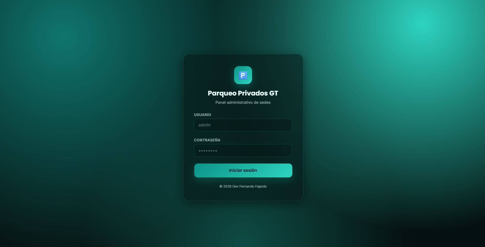
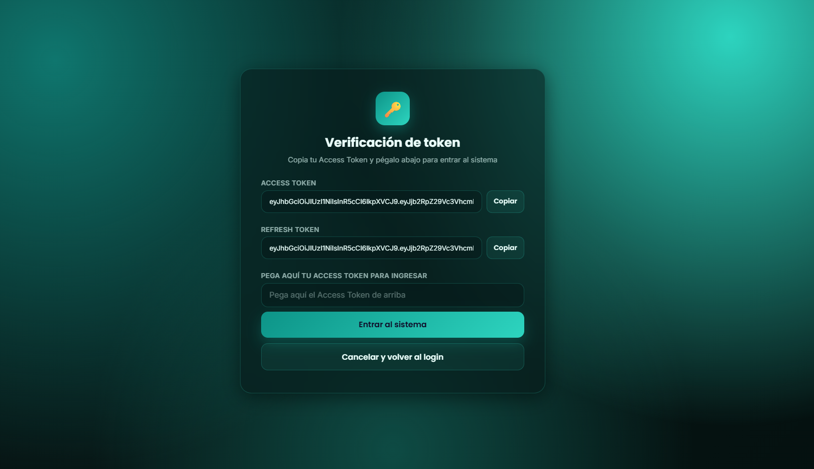
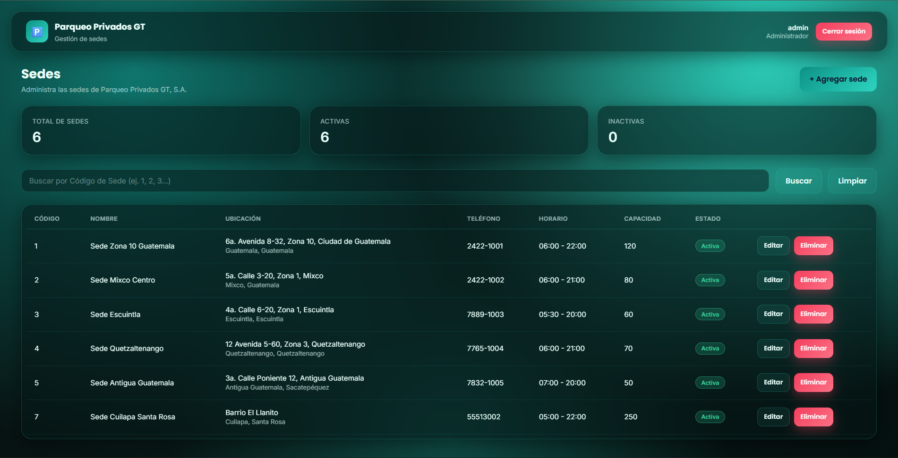

# 🅿️ Parqueo Privados GT

Sistema de administración de parqueos privados desarrollado.


---

## 📖 Descripción

**Parqueo Privados GT, S.A.** es una empresa que ofrece servicios de estacionamiento privado en distintas sedes del país. Este sistema administra sedes, clientes, vehículos, tipos de vehículo, tarifas, espacios disponibles, empleados, turnos, reservaciones, entradas, salidas, pagos e incidencias.

Toda la lógica de negocio está implementada mediante **stored procedures** en PostgreSQL, consumida por una API REST construida en **NestJS**, y expuesta al usuario final mediante un **frontend en React** con diseño glassmorphism. Para esta entrega, el CRUD completo (Agregar, Editar, Eliminar, Consultar, Buscar) se implementó para la tabla **Sedes**, junto con un sistema de autenticación basado en **JWT (access token + refresh token)**.

---

## 🖼️ Capturas de pantalla

<!--
  Agrega aquí tus capturas (colócalas en docs/screenshots/ con estos nombres,
  o los que prefieras, y ajusta las rutas de abajo):
-->

| Login | Verificación de token | Dashboard de Sedes |
|---|---|---|
|  |  |  |

---

## 🗂️ Estructura del repositorio

```
ParqueoPrivadosGT/
├── backend/                     → API REST en NestJS + PostgreSQL
│   └── parqueo-privados-api/
├── frontend/                    → Cliente en React + Vite
│   └── parqueo-frontend/
├── database/                    → Scripts SQL (base, datos de prueba, stored procedures)
└── docs/
    └── screenshots/             → Capturas de pantalla del sistema
```

---

## 🧱 Modelo de base de datos

La base de datos `db_parqueoprivadosgt` está compuesta por **13 tablas** normalizadas (prefijo `Tbl_`, llave primaria `Codigo...`), más una tabla adicional para autenticación:

| Tabla | Descripción |
|---|---|
| `Tbl_Sedes` | Sedes o sucursales de la empresa |
| `Tbl_TiposVehiculos` | Catálogo de tipos de vehículo |
| `Tbl_Clientes` | Clientes particulares y empresariales |
| `Tbl_Vehiculos` | Vehículos registrados por cliente |
| `Tbl_Tarifas` | Tarifas por sede y tipo de vehículo |
| `Tbl_Espacios` | Espacios de parqueo disponibles por sede |
| `Tbl_Empleados` | Empleados asignados a cada sede |
| `Tbl_Turnos` | Turnos de trabajo del personal |
| `Tbl_Reservaciones` | Reservaciones de espacio realizadas por clientes |
| `Tbl_Entradas` | Registro de ingreso de vehículos |
| `Tbl_Salidas` | Registro de salida de vehículos |
| `Tbl_Pagos` | Pagos asociados a cada salida |
| `Tbl_Incidencias` | Incidencias reportadas en las sedes |
| `Tbl_Usuarios` | Usuarios del sistema (login), incluye `VersionToken` para invalidar sesiones |

Toda la lógica de negocio (validaciones, inserciones, actualizaciones) se maneja mediante **stored procedures**:

- **65 procedimientos CRUD** (5 por cada una de las 13 tablas de negocio: `Usp_X_Agregar`, `Usp_X_Editar`, `Usp_X_Eliminar`, `Usp_X_Consultar`, `Usp_X_Buscar`).
- **3 procedimientos de autenticación**: `Usp_Usuarios_BuscarPorUsuario` (login), `Usp_Usuarios_ObtenerVersionToken` y `Usp_Usuarios_CerrarSesion` (invalidación de sesión).

### Scripts (ejecutar en este orden en pgAdmin)

1. `1_Script_Base_Datos_ParqueoPrivadosGT_PostgreSQL.sql` — creación de las 13 tablas.
2. `2_Script_Datos_Prueba_ParqueoPrivadosGT_PostgreSQL.sql` — 5 registros de prueba por tabla.
3. `3_Script_Stored_Procedures_ParqueoPrivadosGT_PostgreSQL.sql` — funciones CRUD para las 13 tablas.
4. `4_Script_Tabla_Usuarios_Login_ParqueoPrivadosGT_PostgreSQL.sql` — tabla de usuarios y funciones de login.
5. Columna `VersionToken` en `Tbl_Usuarios` + funciones `Usp_Usuarios_ObtenerVersionToken` y `Usp_Usuarios_CerrarSesion` (invalidación de sesión al cerrar sesión).

---

## 🔐 Autenticación (JWT)

El sistema usa **dos tokens** por sesión:

- **Access Token** — vida de **60 segundos**. Se envía en cada petición protegida (`Authorization: Bearer <token>`).
- **Refresh Token** — vida de **7 días**. Se guarda sin usarse en cada petición; solo sirve para pedir un Access Token nuevo cuando el anterior expira.

Cuando el Access Token vence, el frontend lo renueva **en silencio** contra `/api/refresh-token` usando el Refresh Token, sin que el usuario tenga que volver a autenticarse. Este ciclo se repite indefinidamente hasta que:

- El usuario presiona **Cerrar sesión** → ambos tokens se invalidan de inmediato (se incrementa `VersionToken` del usuario en la base de datos, lo que invalida cualquier token emitido antes, aunque técnicamente no haya expirado), o
- El Refresh Token llega a sus 7 días de vida → toca iniciar sesión de nuevo.

Como capa extra de verificación, el frontend muestra una pantalla intermedia tras el login donde el usuario debe copiar y pegar su Access Token para confirmar el ingreso al sistema.

---

## ⚙️ Backend — Instalación y ejecución

### Requisitos previos

- Node.js 20+
- PostgreSQL 16 (en este proyecto corre en un contenedor Docker)
- npm

### Pasos

```bash
cd backend/parqueo-privados-api
npm install
```

Crea un archivo `.env` en la raíz de `parqueo-privados-api` con tus credenciales:

```env
DB_HOST=localhost
DB_PORT=5432
DB_USER=postgres
DB_PASSWORD=tu_password
DB_NAME=db_parqueoprivadosgt
DB_POOL_MAX=10

JWT_ACCESS_SECRET=un_secreto_para_access_tokens
JWT_ACCESS_EXPIRES_IN=60s
JWT_REFRESH_SECRET=otro_secreto_totalmente_diferente_para_refresh
JWT_REFRESH_EXPIRES_IN=7d
```

Levanta el servidor en modo desarrollo:

```bash
npm run start:dev
```

La API queda disponible en `http://localhost:3000`.

### 📑 Documentación interactiva (Swagger)

```
http://localhost:3000/api/docs
```

Desde ahí se pueden probar todos los endpoints directamente en el navegador.

---

## 💻 Frontend — Instalación y ejecución

### Requisitos previos

- Node.js 20+
- El backend corriendo en `http://localhost:3000`

### Pasos

```bash
cd frontend/parqueo-frontend
npm install
npm run dev
```

La aplicación queda disponible en `http://localhost:5173`.

### Stack y características

- **React 18 + Vite 5**
- Diseño **glassmorphism** con acento turquesa
- Login → pantalla de verificación de token → dashboard
- CRUD completo de Sedes (agregar, editar, eliminar, consultar, buscar por código)
- Renovación automática del Access Token en segundo plano usando el Refresh Token
- Cierre de sesión que invalida ambos tokens en el servidor

---

## 🔌 Endpoints disponibles

**Base URL:** `http://localhost:3000/api`

### Auth

| Método | Endpoint | Descripción |
|---|---|---|
| `POST` | `/login` | Inicia sesión. Devuelve `accessToken` (60s) y `refreshToken` (7 días) |
| `POST` | `/refresh-token` | Renueva el `accessToken` a partir de un `refreshToken` válido |
| `POST` | `/logout` | Invalida el `accessToken` y `refreshToken` vigentes (requiere Bearer token) |

### Sedes

> Todos los endpoints de Sedes requieren `Authorization: Bearer <accessToken>`.

| Método | Endpoint | Descripción |
|---|---|---|
| `POST` | `/sedesAgregar` | Crea una nueva sede |
| `PUT` | `/sedesEditar/{codigoSede}` | Edita una sede existente |
| `DELETE` | `/sedesEliminar/{codigoSede}` | Elimina una sede |
| `GET` | `/sedesConsultar` | Lista todas las sedes |
| `GET` | `/sedesBuscar/{codigoSede}` | Busca una sede por código exacto |

Todas las respuestas siguen el mismo formato:

```json
{
  "exito": 1,
  "mensaje": "Registro agregado correctamente.",
  "datos": { }
}
```

---

## 🧩 Stack tecnológico

- **Backend:** NestJS 12 (Node.js + TypeScript)
- **Frontend:** React 18 + Vite 5
- **Base de datos:** PostgreSQL 16 (contenedor Docker)
- **Driver:** node-postgres (`pg`)
- **Autenticación:** JWT (`@nestjs/jwt`) con access + refresh token
- **Documentación de API:** Swagger (`@nestjs/swagger`)
- **Testing:** Vitest

---

## 👤 Developer

**Fernando Guadalupe Fajardo Solórzano**

---

## 📄 Licencia
PRO
